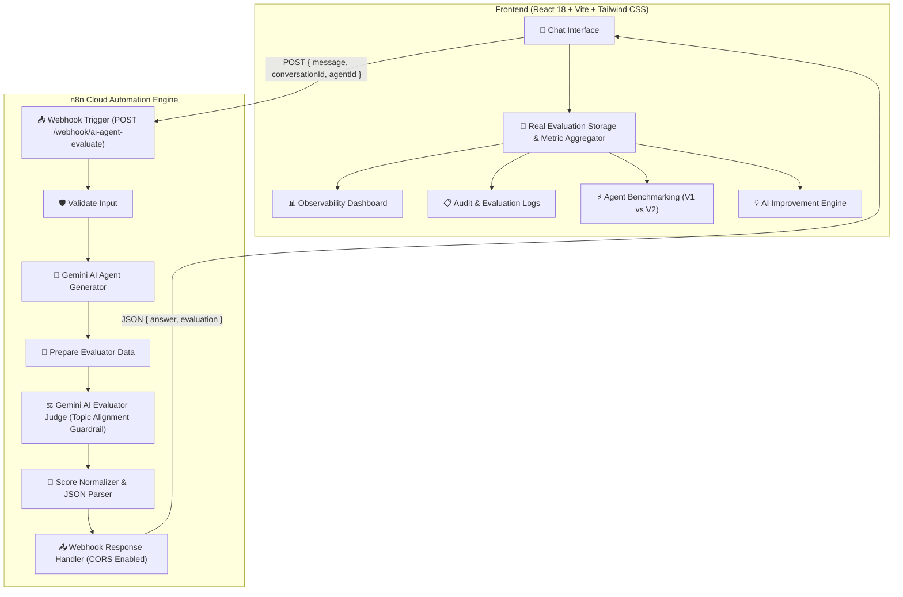

# AI-Assisted Continuous Review and Performance Improvement of AI Agents

A production-grade final-year B.Tech engineering project implementing an **Observability, Continuous Review, and Performance Optimization Platform** for AI Agents.

---

## 🌟 Core Architecture



---

## 🚀 Environment Variables

Located in `.env`:
```env
VITE_N8N_WEBHOOK_URL=https://finalyearproject.app.n8n.cloud/webhook-test/ai-agent-evaluate
VITE_DEFAULT_AGENT_ID=agent-v1
VITE_API_TIMEOUT=45000
```

---

## 🛠️ Verification & Run Instructions

### 1. Start the React Frontend
```bash
npm run dev
```
Open `http://localhost:5173`.

### 2. Verify n8n Webhook
1. Open n8n Cloud at `https://finalyearproject.app.n8n.cloud`.
2. Import `n8n/ai_agent_evaluation_workflow.json`.
3. Set your Google Gemini API Key.
4. When testing with the test URL, make sure the Webhook node in n8n is actively listening (`"Listen for test event"`).
5. Send a prompt from the React Chat interface and inspect the real response in the console and UI.
