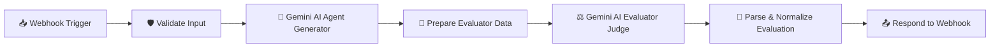

# n8n AI Agent Evaluation Workflow Setup Guide

This folder contains the complete n8n workflow for the **AI-Assisted Continuous Review and Performance Improvement of AI Agents** platform.

---

## 🏗️ Workflow Architecture



---

## 1. Prerequisites

1. **n8n Cloud** or self-hosted n8n instance.
2. Active Webhook URL (Test or Production):
   - **Test Webhook**: `https://finalyearproject.app.n8n.cloud/webhook-test/ai-agent-evaluate`
   - **Production Webhook**: `https://finalyearproject.app.n8n.cloud/webhook/ai-agent-evaluate`
3. A **Google Gemini API Key** configured in n8n credentials or environment variable `GEMINI_API_KEY`.

---

## 2. Step-by-Step Import & Configuration in n8n

1. **Open n8n**: Log into your n8n workspace at `https://finalyearproject.app.n8n.cloud`.
2. **Import Workflow**:
   - In the top-right menu, select **Import from File...**
   - Select `n8n/ai_agent_evaluation_workflow.json`.
3. **Configure Gemini Credentials**:
   - Open node `Gemini AI Agent (Generator)` and ensure your Google Gemini API key or credential is set.
   - Open node `Gemini AI Evaluator (Critic)` and ensure your Google Gemini API key or credential is set.
4. **Test vs Production Webhook Mode**:
   - **When Testing in n8n**: Click **"Test step"** or **"Listen for test event"** on the Webhook node, and send requests to the `/webhook-test/ai-agent-evaluate` endpoint.
   - **When Running in Production**: Toggle the workflow switch in the top right to **Active** (green) to enable the `/webhook/ai-agent-evaluate` endpoint.

---

## 3. Webhook Specification

### **Request**
- **Method**: `POST`
- **Headers**: `Content-Type: application/json`
- **Body**:
```json
{
  "message": "What is Spring Boot in Java?",
  "conversationId": "conv-12345",
  "agentId": "agent-v1"
}
```

### **Response (Strict JSON)**
```json
{
  "success": true,
  "conversationId": "conv-12345",
  "agentId": "agent-v1",
  "agentVersion": "v1.0.0",
  "userInput": "What is Spring Boot in Java?",
  "answer": "Spring Boot is an open-source Java-based framework...",
  "evaluation": {
    "correctness": 9.5,
    "relevance": 10.0,
    "completeness": 9.0,
    "clarity": 9.5,
    "instruction_following": 9.5,
    "overall_score": 9.5,
    "verdict": "PASS",
    "strengths": [
      "Accurately explains auto-configuration and embedded servers"
    ],
    "weaknesses": [],
    "improvement_suggestions": [
      "Include a starter pom.xml dependency snippet"
    ]
  },
  "createdAt": "2026-09-18T12:00:00.000Z"
}
```

---

## 4. Topic Alignment & Wrong-Topic Guardrail

The Gemini AI Evaluator strictly enforces question-answer topic alignment before checking writing quality:
- If the AI answers an unrelated topic (e.g. user asks about *Spring Boot*, but AI answers about *Polymorphism*):
  - `correctness`: `0`
  - `relevance`: `0`
  - `completeness`: `0`
  - `instruction_following`: `0`
  - `overall_score`: `(0 + 0 + 0 + clarity + 0) / 5`
  - `verdict`: `FAIL`
  - `weaknesses`: `["The response does not answer the user's question about Spring Boot and discusses an unrelated topic."]`
